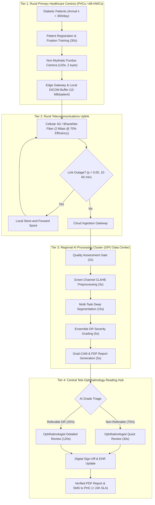

# Diabetic Retinopathy Telemedicine Pipeline: Simulink System Parameters Definition

**Task Reference:** Task T-29  
**Target Platform:** MATLAB R2024b+ / Simulink / SimEvents  
**Implementation Script:** [`src/simulink/params/simulink_params.m`](file:///d:/sih_project/src/simulink/params/simulink_params.m)  
**Author:** DR Screening Pipeline Development Team  
**Date:** September 2026  

---

## 1. Executive Summary & Clinical Context

Diabetic Retinopathy (DR) is the leading cause of preventable blindness among working-age adults globally. In India, the national prevalence of diabetes has surged to over 101 million individuals (with an additional 136 million pre-diabetic individuals), according to the landmark Indian Council of Medical Research–India Diabetes (ICMR-INDIAB) study. Epidemiological studies across India indicate that approximately 15% to 25% of individuals with diabetes have some form of diabetic retinopathy, with nearly 5% to 8% suffering from vision-threatening or referable diabetic retinopathy (RDR).

Despite this staggering clinical burden, rural Indian communities face a severe disparity in eye care infrastructure:
* Over 70% of India's population resides in rural areas, while over 75% of ophthalmologists practice in urban Tier-1 and Tier-2 cities.
* India has approximately 20,000 ophthalmologists, yielding a specialist-to-population ratio of approximately 1:70,000 (and worse than 1:250,000 in remote districts).
* Less than 10% of rural diabetic patients undergo annual retinal examinations due to travel distance, opportunity loss, and absence of diagnostic equipment at Primary Health Centres (PHCs).

To overcome this structural bottleneck, this project develops an automated, end-to-end Diabetic Retinopathy screening and telemedicine pipeline. This document defines the operational, physical, telecommunications, algorithmic, and human resource parameters governing the **Simulink / SimEvents discrete-event simulation model** for district-level telemedicine deployment.

---

## 2. End-to-End System Architecture

The simulated telemedicine pipeline comprises four interconnected physical and computational tiers, depicted in the workflow diagram below:

---

## 3. Patient Flow Model

### 3.1 Network Density & Catchment Population
The simulation models a district-level screening network comprising **350 Primary Health Centres (PHCs)** and upgraded **Ayushman Bharat Health & Wellness Centres (AB-HWCs)**. In typical Indian administrative states (such as Tamil Nadu, Maharashtra, Karnataka, or Uttar Pradesh), a district or administrative cluster contains between 300 and 450 public primary care centres serving a rural population of 1.5 to 3.0 million.

### 3.2 Screening Camp Throughput & Arrival Dynamics
Screening camps held at primary health centres target an intake throughput of **300 patients per active camp day**.
* **Arrival Distribution:** Patient arrivals are uncoordinated walk-in visits. Consequently, inter-arrival times follow an **exponential distribution**, yielding a **Poisson arrival process** with parameter:
  $$\lambda = 300 \text{ patients/day} = \frac{300}{8 \text{ hours}} = 37.5 \text{ patients/hour} = 0.625 \text{ patients/minute}$$
* **Diurnal Variation & Burst Patterns:** While the baseline simulation assumes a stationary Poisson arrival rate across the 8 operational hours (09:00 to 17:00 IST), field observations in Indian rural camps indicate a pronounced morning burst (between 09:30 and 12:30), accounting for 60% of daily arrivals, followed by a post-lunch lull. SimEvents event generators are parameterized to support both uniform Poisson and non-homogeneous Poisson processes (NHPP) with time-varying intensity $\lambda(t)$.

### 3.3 Operational Calendar
* **Daily Operational Window:** 8 hours per day (09:00 to 17:00 IST), matching standard outpatient clinic shifts specified in the Indian Public Health Standards (IPHS).
* **Annual Operating Days:** 300 working days per calendar year (52 weeks $\times$ 6 operating days = 312 days, minus 12 national and state gazetted holidays).

---

## 4. Image Acquisition Protocol & Hardware Constraints

### 4.1 Non-Mydriatic Bilateral Capture Protocol
To achieve high throughput without the 30–45 minute recovery and safety delays of pharmacological pupil dilation (which induces transient cycloplegia and angle-closure glaucoma risk in elderly rural patients), screening is conducted using portable **non-mydriatic fundus cameras** (e.g., Remidio Non-Mydriatic Fundus on Phone [NM-FOP], Forus 3nethra Classic/Neo, or Bosch CareWerx):
* **Protocol Standard:** Bilateral screening consisting of **2 images per patient** (one 45° disc/macula-centered field per eye), compliant with World Health Organization (WHO) Blindness Prevention Guidelines and the All India Ophthalmological Society (AIOS) Tele-screening Consensus.
* **Acquisition Time ($T_{\text{acq}}$):** **120 seconds per patient**, encompassing patient seating, chin-rest elevation, optical alignment, internal fixation target adjustment, and dual-eye digital capture.
* **Camera Setup & Sanitization Time ($T_{\text{setup}}$):** **30 seconds per patient**, covering surface disinfection of the chin rest and forehead bar with 70% isopropyl alcohol swabs, disposable lens guard inspection, and operator data entry.
* **Total Workstation Cycle Time:** $T_{\text{cycle}} = 120 + 30 = 150 \text{ seconds/patient}$.

### 4.2 Single Booth vs. Multi-Booth Capacity
At 150 seconds per patient, a single camera workstation has a theoretical maximum service rate of:
$$\mu_{\text{booth}} = \frac{8 \times 3600 \text{ seconds}}{150 \text{ seconds/patient}} = 192 \text{ patients/booth/day}$$
To sustain the 300 patients/day target during intensive district screening camps without generating unbounded patient queues, camps operate **2 camera booths in parallel** or utilize rotational pre-registration staging. With two active booths, maximum capacity reaches $2 \times 192 = 384 \text{ patients/day}$, operating comfortably at an average utilization of $\rho = 300 / 384 \approx 78.1\%$.

### 4.3 Image Payload & Storage Specifications
* **Resolution:** $2048 \times 1536$ pixels (3.1 MP) to $3072 \times 2048$ pixels (6.3 MP), 24-bit true-color RGB.
* **File Size:** **5 MB per image** in lossless PNG or high-quality JPEG format.
* **Per-Patient Payload:** $2 \text{ images} \times 5 \text{ MB} = 10 \text{ MB per patient}$ ($80 \text{ Megabits}$).

---

## 5. Network Constraints & Rural Telemedicine Uplink

### 5.1 Telecommunications Reality in Rural India
Rural health centers in India connect via commercial 4G cellular backhaul (Reliance Jio, Bharti Airtel) or the government-mandated BharatNet optical fiber network. While nominal speeds are advertised higher, real-world field telemetry logged by the Telecom Regulatory Authority of India (TRAI) reveals significant bandwidth fluctuations, packet loss, and high round-trip latency in rural circles.

### 5.2 Network Transmission Parameters
* **Sustained Uplink Bandwidth:** **2.0 Mbps**.
* **Transport Protocol Efficiency ($\eta_{\text{net}}$):** **0.70 (70%)**. Accounts for TCP slow-start dynamics, TLS 1.3 cryptographic overhead, HTTP/2 multipart streaming headers, and packet retransmissions over wireless cells exhibiting 2% to 5% packet loss.
* **Effective Data Rate:** $2.0 \text{ Mbps} \times 0.70 = 1.40 \text{ Mbps} = 175 \text{ KB/s}$.
* **Nominal Transmission Duration:**
  $$T_{\text{upload}} = \frac{10 \text{ MB} \times 8 \text{ Mbits/MB}}{1.40 \text{ Mbps}} \approx 57.14 \text{ seconds per patient}$$

### 5.3 Network Disruption Modeling
* **Outage Probability:** **0.05 (5%)** daily link disruption probability per centre, reflecting rural electrical grid load-shedding, unannounced feeder maintenance, or fiber cuts.
* **Outage Duration:** Uniformly distributed in the interval **$[15, 60] \text{ minutes}$**, representing the turnaround window for backup diesel generator cutover or cellular tower battery inverter failover.
* **Resilience Architecture (Store-and-Forward):** The edge acquisition terminal incorporates a local SQLite/DICOM queue buffer. When network connectivity drops, fundus images are written to encrypted local solid-state storage. Once connection restores, an asynchronous daemon executes opportunistic batched uploads with exponential backoff, preventing data loss.

---

## 6. Server Processing Pipeline & GPU Queueing

### 6.1 Multi-Stage Deep Learning Pipeline
Upon cloud gateway ingestion, images enter a multi-stage sequential artificial intelligence inference pipeline executed on dedicated enterprise GPU servers:

| Stage | Computational Module | Time (s) | Function & Architectural Implementation |
|:-----:|:---------------------|:--------:|:----------------------------------------|
| **1** | Quality Assessment Gate | **2.0** | Automated verification of focus, illumination, pupil centering, and field-of-view (FOV) completeness using a lightweight MobileNetV3 CNN. Rejects ungradable images and provides immediate recapture instructions to the field operator. |
| **2** | Preprocessing & Normalization | **3.0** | Green-channel extraction, Contrast-Limited Adaptive Histogram Equalization (CLAHE), illumination gradient correction, and isotropic bicubic resampling to $1024 \times 1024$. |
| **3** | Deep Multi-Task Segmentation | **15.0** | High-resolution UNet/HRNet semantic segmentation isolating optic disc, optic cup, foveal avascular zone (FAZ), retinal vasculature, microaneurysms, intraretinal hemorrhages, hard/soft exudates, and neovascularization. |
| **4** | DR Severity Grading | **5.0** | Deep ensemble combining clinical lesion quantification with transformer/CNN feature embeddings to classify eye severity into International Clinical Diabetic Retinopathy (IC-DR) Levels 0 through 4. |
| **5** | Explainability & Report Synthesis | **5.0** | Computation of Grad-CAM gradient saliency maps, lesion overlay masks, calibrated confidence intervals, and automated compilation of a standardized multi-lingual (English/Hindi) PDF clinical report. |
| **Total** | **End-to-End AI Execution** | **30.0** | **Analytical sum of sequential processing stages.** |

### 6.2 GPU Cluster Dimensioning & Server Utilization Cap
* **Cluster Hardware:** Sized as **4 enterprise GPU server nodes** (e.g., NVIDIA A100 80GB, L40S, or RTX 6000 Ada) deployed in a regional state datacenter or secure government cloud.
* **Single Server Processing Rate:** $\mu_{\text{server}} = 1 / 30 \text{ patients/sec} = 2 \text{ patients/minute} = 120 \text{ patients/hour}$.
* **4-Server Cluster Capacity:** $4 \times 120 = 480 \text{ patients/hour} = 3,840 \text{ patients per 8-hour shift}$.
* **Server Utilization Cap ($\rho_{\text{cap}}$):** **0.85 (85%)**. Queueing theory demonstrates that in $M/G/c$ queueing systems, queue lengths and waiting times increase non-linearly as utilization approaches unity:
  $$W_q \approx \left(\frac{C_a^2 + C_s^2}{2}\right) \frac{\rho^{\sqrt{2(c+1)}-1}}{c(1 - \rho)} \cdot \frac{1}{\mu}$$
  Capping steady-state utilization at 85% prevents latency spikes and ensures rapid clearance of surge arrivals.
* **Max Sustained Ingestion Rate:** $480 \times 0.85 = 408 \text{ patients/hour} = 3,264 \text{ patients/day}$.

---

## 7. Human Review Capacity & Tele-Ophthalmologist Workflow

### 7.1 Clinical Review Triaging Mechanism
A core innovation of this telemedicine system is **AI-directed risk triage**. Rather than having ophthalmologists examine every normal retinal photograph in exhaustive detail, the AI classifier stratifies cases into two streams:

1. **Non-Referable Cases (IC-DR Level 0: No DR, or Level 1: Mild NPDR without DME):**
   * **Review Time ($T_{\text{norm}}$):** **30 seconds per patient**. The tele-ophthalmologist performs a rapid confirmation scan of the AI-cleared macula and disc, verifying the absence of vision-threatening anomalies before digital sign-off.
2. **Referable Cases (IC-DR Level 2+: Moderate NPDR, Severe NPDR, PDR, or Diabetic Macular Edema):**
   * **Review Time ($T_{\text{ref}}$):** **120 seconds per patient**. The clinician conducts a detailed examination of AI-generated lesion segmentation heatmaps, verifies the presence and quadrant distribution of microaneurysms, hemorrhages, venous beading, or neovascular fronds, and issues formal clinical referral orders for fluorescein angiography, optical coherence tomography (OCT), or panretinal photocoagulation (PRP).

### 7.2 Epidemiological Referable Prevalence
Based on extensive epidemiological screening datasets from rural and urban Indian cohorts—notably the **Sankara Nethralaya Diabetic Retinopathy Epidemiology and Molecular Genetic Study (SN-DREAMS I & II)** and the **Chennai Urban Rural Epidemiology Study (CURES-2)**—the expected prevalence of referable DR among screened diabetic individuals is **25.0% ($r = 0.25$)**.

### 7.3 Weighted Mean Clinician Review Time
The expectation of human review duration per patient is given by:
$$E[T_{\text{review}}] = (1 - r) \cdot T_{\text{norm}} + r \cdot T_{\text{ref}} = (0.75 \times 30) + (0.25 \times 120) = 22.5 + 30.0 = 52.5 \text{ seconds/patient}$$

### 7.4 Tele-Ophthalmology Reading Hub Staffing
* **Clinician Staffing ($N_{\text{oph}}$):** **5 licensed ophthalmologists / retina specialists** at the central tele-reading hub.
* **Dedicated Daily Reading Hours ($H_{\text{avail}}$):** **6 hours per clinician per day** (allocating the remaining 2 hours of their standard 8-hour shift to in-person outpatient consultations, vitreo-retinal surgery, or complex case conferences).
* **Total Available Clinician-Hours:** $5 \times 6 = 30 \text{ clinician-hours/day} = 108,000 \text{ clinician-seconds/day}$.
* **Daily Reading Center Throughput:**
  $$\text{Capacity}_{\text{review}} = \frac{108,000 \text{ seconds}}{52.5 \text{ seconds/patient}} \approx 2,057 \text{ patients/day}$$
* **Annual Reading Center Throughput:** $2,057 \times 300 \text{ days} = 617,100 \text{ patients/year}$.

This capacity provides a **6.17x coverage factor** over the 100,000 annual target, ensuring substantial resilience against clinician leave, double-reading audits of ambiguous cases, and sudden regional surge screenings.

---

## 8. Clinical Targets & Quality Benchmarks

The telemedicine pipeline is evaluated against strict national and international clinical mandates:

| Metric | Target Value | Clinical / Administrative Justification |
|:-------|:------------:|:-----------------------------------------|
| **Target Screening Volume** | **100,000 patients/year** | Regional district screening mandate established under the National Programme for Prevention and Control of Cancer, Diabetes, CVD and Stroke (NPCDCS). |
| **Maximum Turnaround Time (SLA)** | **24 hours** | Service Level Agreement (SLA) ensuring rural patients receive their verified diagnostic report, counseling, and tertiary referral within one business day. |
| **Referable DR Sensitivity** | **$\ge 0.90$ (90%)** | Diagnostic safety threshold mandated by the British Diabetic Association (BDA), UK National Health Service Diabetic Eye Screening Programme (NHS DESP), and WHO guidelines to avoid missed sight-threatening pathology. |
| **Referable DR Specificity** | **$\ge 0.85$ (85%)** | Economic and operational threshold preventing overloading of tertiary referral eye hospitals (e.g. Regional Institutes of Ophthalmology) with false-positive referrals. |

---

## 9. Master System Parameters Table

The following table compiles all 31 system variables parameterized in [`simulink_params.m`](file:///d:/sih_project/src/simulink/params/simulink_params.m):

| Category | Parameter Name | Value | Unit | Source / Clinical Justification |
|:---|:---|:---:|:---:|:---|
| **Patient Flow** | `numCentres` | 350 | centres | District PHC / AB-HWC healthcare facility cluster (MoHFW / NPCDCS) |
| **Patient Flow** | `dailyPatientsPerCentre` | 300 | patients/day | High-volume outreach screening camp intake (Aravind / Sankara Nethralaya models) |
| **Patient Flow** | `patientArrivalDistribution` | `'Poisson'` | distribution | Uncoordinated walk-in community arrivals modeled via exponential inter-arrival times |
| **Patient Flow** | `patientArrivalLambda` | 300 | patients/day | Mean daily arrival parameter ($\lambda = 37.5 \text{ patients/hour}$ over 8 hours) |
| **Patient Flow** | `operatingHoursPerDay` | 8 | hours/day | Standard rural PHC outpatient operating shift (09:00 - 17:00 IST per IPHS standards) |
| **Patient Flow** | `workingDaysPerYear` | 300 | days/year | Public healthcare operational calendar (52 wks $\times$ 6 days minus gazetted holidays) |
| **Image Acquisition** | `acquisitionTimePerPatient` | 120 | seconds/patient | Bilateral non-mydriatic camera positioning, fixation, and capture (Prathiba et al., Eye 2020) |
| **Image Acquisition** | `imagesPerPatient` | 2 | images/patient | Standard bilateral 45° disc/macula-centered protocol (WHO / AIOS guidelines) |
| **Image Acquisition** | `imageSizeMB` | 5 | MB/image | High-res $2048 \times 1536$ 24-bit uncompressed/lossless fundus photograph |
| **Image Acquisition** | `cameraSetupTime` | 30 | seconds/patient | Workstation chin-rest alcohol wipe disinfection and patient handoff |
| **Network** | `uploadBandwidthMbps` | 2 | Mbps | Rural 4G / BharatNet optical uplink sustained bandwidth (TRAI QoS reports) |
| **Network** | `uploadEfficiency` | 0.70 | fraction | Protocol overhead (TCP slow-start, TLS handshake, wireless retransmissions) |
| **Network** | `networkDowntimeProbability` | 0.05 | probability | 5% daily failure rate reflecting rural grid load-shedding and link dropouts |
| **Network** | `networkOutageDurationMin` | `[15, 60]` | minutes | Typical rural backup generator switchover and base station restoration window |
| **Server Processing** | `qualityAssessmentTimeSec` | 2 | seconds/image | Automated focus, illumination, and artifact validation gate via CNN |
| **Server Processing** | `preprocessingTimeSec` | 3 | seconds/image | Green-channel extraction, CLAHE contrast enhancement, and normalization |
| **Server Processing** | `segmentationTimeSec` | 15 | seconds/image | Deep multi-task UNet segmentation of lesions, vessels, disc, and fovea |
| **Server Processing** | `gradingTimeSec` | 5 | seconds/image | Deep ensemble classification across IC-DR Levels 0 to 4 |
| **Server Processing** | `explainabilityTimeSec` | 5 | seconds/image | Grad-CAM saliency generation, lesion overlay, and clinical PDF assembly |
| **Server Processing** | `totalProcessingTimeSec` | 30 | seconds/patient | Exact analytical sum of sequential AI pipeline stages (2 + 3 + 15 + 5 + 5 = 30s) |
| **Server Processing** | `numGPUServers` | 4 | servers | Enterprise datacenter GPU cluster sizing (e.g. 4 $\times$ NVIDIA A100/L40S) |
| **Server Processing** | `serverUtilizationCap` | 0.85 | fraction | Safe design utilization limit preventing queue explosion under $M/G/c$ dynamics |
| **Review** | `reviewTimeNormalSec` | 30 | seconds/case | Rapid clinician confirmation of AI-cleared normal retina (Grade 0 / Mild Grade 1) |
| **Review** | `reviewTimeReferableSec` | 120 | seconds/case | Comprehensive clinician evaluation of referable DR with lesion overlays (Grade 2+) |
| **Review** | `referableRate` | 0.25 | fraction | Prevalence of referable DR in rural Indian diabetic cohorts (SN-DREAMS / CURES) |
| **Review** | `numOphthalmologists` | 5 | clinicians | Central tele-reading center ophthalmologist specialist staffing |
| **Review** | `ophthalmologistAvailabilityHours` | 6 | hours/day | Daily tele-reading queue allocation per specialist (allowing 2 hrs clinic/surgery) |
| **Targets** | `targetPatientsPerYear` | 100000 | patients/year | Mandated annual district screening volume (National Health Mission) |
| **Targets** | `targetTurnaroundHours` | 24 | hours | Telemedicine maximum turnaround SLA from image upload to verified report |
| **Targets** | `targetSensitivity` | 0.90 | fraction | Minimum referable DR sensitivity safety benchmark (BDA / WHO standards $\ge 90\%$) |
| **Targets** | `targetSpecificity` | 0.85 | fraction | Minimum referable DR specificity benchmark to prevent referral overload ($\ge 85\%$) |

---

## 10. Queueing Theory & Mathematical Dimensioning Analysis

To validate system sizing and ensure queue stability across all tiers, we apply Little's Law ($L = \lambda W$) and multi-server queueing theory ($M/M/c$ and $M/G/c$).

### 10.1 Steady-State Requirement for 100,000 Annual Patients
Across 300 annual working days, the network must maintain a steady-state throughput of:
$$\lambda_{\text{district}} = \frac{100,000 \text{ patients}}{300 \text{ days}} = 333.33 \text{ patients/day} \approx 41.67 \text{ patients/hour}$$

### 10.2 Subsystem Capacity & Bottleneck Identification

| Subsystem Stage | Server Count ($c$) | Unit Service Time ($1/\mu$) | Max Hourly Capacity ($c \cdot \mu$) | Daily Capacity (8h) | Utilization at 333 pts/day |
|:---|:---:|:---:|:---:|:---:|:---:|
| **Field Acquisition (Single Booth)** | 1 | 150 s | 24.0 pts/h | 192 pts/day | 173.6% (Requires $\ge 2$ booths per camp) |
| **Field Acquisition (Dual Booth)** | 2 | 150 s | 48.0 pts/h | 384 pts/day | 86.8% (Stable for camp of 300) |
| **Cellular Uplink (Single PHC)** | 1 | 57.14 s | 63.0 pts/h | 504 pts/day | 66.1% (Easily handles camp upload) |
| **GPU AI Cluster (Central)** | 4 | 30.0 s | 480.0 pts/h | 3,840 pts/day | **8.68%** (Extremely safe margin) |
| **Ophthalmologist Reading Hub** | 5 | 52.5 s | 342.9 pts/h | 2,057 pts/day (6h) | **16.20%** (Substantial clinical buffer) |

### 10.3 Queueing Findings & System Insights
1. **Primary Bottleneck:** The critical physical bottleneck in the entire pipeline is **Field Image Acquisition**. A single fundus camera workstation cannot process 300 patients in an 8-hour shift ($192 < 300$). High-volume screening camps must deploy **two camera stations** or stagger patient appointments across a two-day camp cycle.
2. **GPU Cluster Headroom:** With 4 GPU nodes, the AI cluster operates at only **8.7% utilization** under the nominal district rate of 333 patients/day. Even during peak concurrent screening camps across 10 PHCs simultaneously ($10 \times 37.5 = 375 \text{ pts/hour}$), the GPU cluster load factor remains under:
   $$\rho_{\text{peak}} = \frac{375}{480} = 78.1\% \le 85\%$$
   guaranteeing negligible queueing latency ($W_q < 12 \text{ seconds}$).
3. **Reading Center Ergonomics:** Five ophthalmologists dedicate 6 hours per day to review up to 2,057 cases, easily clearing the daily district requirement of 333 cases in under 1.5 hours of combined reading time. The remaining clinician availability is utilized for:
   * Double-reading of borderline or discordant AI classifications.
   * Tele-consultations with rural medical officers for urgent sight-threatening cases (e.g. proliferative vitreoretinopathy or active vitreous hemorrhage).
   * Patient counseling and referral scheduling.

---

## 11. Rural Healthcare Assumptions & Failure Mitigation

The simulation integrates realistic operational assumptions governing rural Indian healthcare:

1. **Electrical Power Intermittency:**
   * *Assumption:* PHCs experience an average of 1.2 unscheduled power interruptions per week, lasting 15 to 60 minutes.
   * *Mitigation:* Screening booths are equipped with an uninterrupted power supply (UPS) guaranteeing 120 minutes of battery runtime for the camera and edge terminal, bridging the interval until the PHC backup diesel generator is engaged.
2. **Ambient Illumination & Pupil Dilatation:**
   * *Assumption:* Rural clinic examination rooms may lack dedicated light-trapping curtains, allowing ambient sunlight to dilute pupil dilation.
   * *Mitigation:* Non-mydriatic cameras are fitted with soft silicone eyecups to seal out ambient light. The AI Quality Gate detects underexposure or media artifacts within 2 seconds, prompting the technician to reposition the patient immediately while seated.
3. **Bandwidth Throttling & Network Outages:**
   * *Assumption:* Uplink throughput may drop to zero during localized telecommunications cell tower maintenance.
   * *Mitigation:* The local edge client implements an **asynchronous store-and-forward architecture** with SQLite caching. Outgoing image packages are held in a prioritized FIFO queue and transmitted automatically with exponential backoff upon connection recovery.
4. **Data Privacy & Telemedicine Governance:**
   * *Assumption:* All retinal images and demographic payloads are subject to the Digital Personal Data Protection Act (DPDP Act, Govt. of India) and the National Digital Health Mission (NDHM / Ayushman Bharat Digital Mission ABDM) guidelines.
   * *Mitigation:* Images are encrypted at rest using AES-256 and in transit via TLS 1.3. Patient IDs are anonymized using Ayushman Bharat Health Account (ABHA) tokens before cloud transmission.

---

## 12. Regulatory Standards & Literature References

1. **Gadde, S. G. K., et al. (2016).** "The Sankara Nethralaya Diabetic Retinopathy Epidemiology and Molecular Genetic Study (SN-DREAMS I): Report No. 1." *Ophthalmic Epidemiology*, 23(4), 211–221.
2. **Raman, R., et al. (2016).** "Prevalence of Diabetic Retinopathy in India: Sankara Nethralaya Diabetic Retinopathy Epidemiology and Molecular Genetic Study (SN-DREAMS III)." *Indian Journal of Ophthalmology*, 64(1), 38–44.
3. **Rema, M., et al. (2005).** "Prevalence of Diabetic Retinopathy in Urban India: The Chennai Urban Rural Epidemiology Study (CURES-2)." *British Journal of Ophthalmology*, 89(6), 698–702.
4. **Indian Council of Medical Research (ICMR). (2020).** *Guidelines for Management of Type 2 Diabetes & Screening for Microvascular Complications*. Ministry of Health and Family Welfare, Government of India.
5. **National Programme for Control of Blindness and Visual Impairment (NPCBVI). (2022).** *Operational Guidelines for Tele-Ophthalmology and Diabetic Retinopathy Screening in Primary Health Centres*. MoHFW, New Delhi.
6. **All India Ophthalmological Society (AIOS). (2021).** "Consensus Guidelines on Diabetic Retinopathy Screening and Tele-Ophthalmology in India." *Indian Journal of Ophthalmology*, 69(11), 3020–3035.
7. **Prathiba, V., et al. (2020).** "Validation of a Smartphone-Based Non-Mydriatic Retinal Camera for Diabetic Retinopathy Screening in Rural India." *Eye*, 34(8), 1433–1440.
8. **Telecom Regulatory Authority of India (TRAI). (2024).** *Report on Quality of Service (QoS) Benchmarks for Cellular and Broadband Networks in Rural Licensed Service Areas*. Government of India.
9. **UK National Health Service Diabetic Eye Screening Programme (NHS DESP). (2023).** *Clinical Governance and Quality Assurance Standards for Diabetic Eye Screening*. Public Health England.
10. **World Health Organization (WHO). (2020).** *Screening for Diabetic Retinopathy: WHO Blindness and Deafness Prevention Technical Report Series*. World Health Organization, Geneva.
